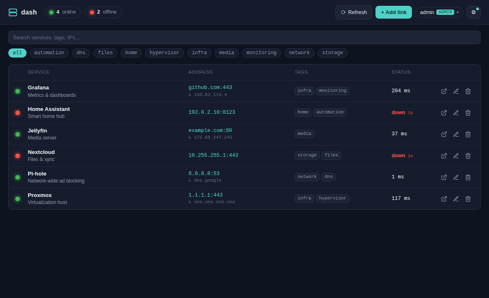

# dash — Documentation

dash is a self-hosted "network console" for your home lab: register internal
services as links and watch their status, checked **server-side** over a background
loop. It serves over HTTPS, supports user accounts, and runs as a single Docker
container with no build step and nothing external in the browser.

## Contents

- **[Getting started](./getting-started.md)** — install, run, first-run admin, sign in
- **[User guide](./user-guide.md)** — links, status checks, search, tags, views, themes
- **[Administration](./administration.md)** — accounts, user management, sessions
- **[Deployment](./deployment.md)** — Docker, Ubuntu Server, HTTPS, backups, GHCR
- **[Configuration](./configuration.md)** — environment variable reference
- **[Updates](./updates.md)** — update notifications and the release flow
- **[Architecture](./architecture.md)** — how it works + the HTTP API reference

## At a glance

- **Backend:** Python + FastAPI — one process serves the JSON API and the static UI
- **Storage:** SQLite, a single file on a host bind-mount
- **Frontend:** plain HTML/CSS/JS — no build step, no CDN, no web fonts (works offline)
- **Security:** HTTPS (self-signed cert), accounts with pbkdf2-hashed passwords
- **Checks:** `tcp` (port open) or `http` (any response = up), with latency + DNS discovery
