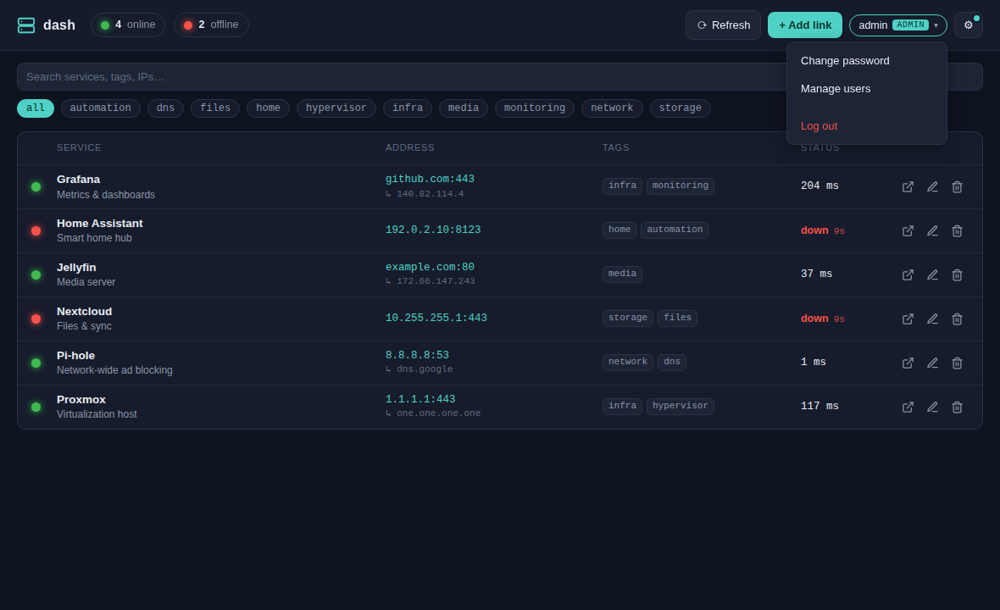
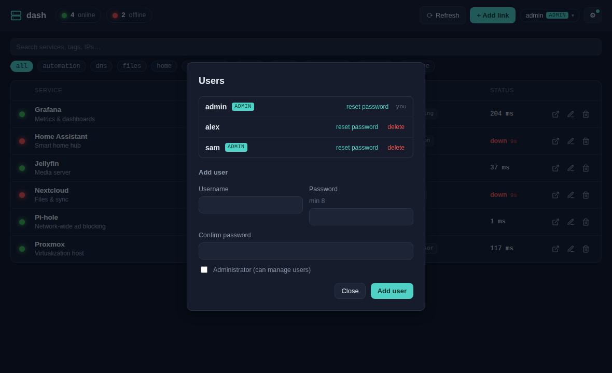

# Administration

dash requires a login. The first account created (during setup) is an **admin**.
Admins can manage other users; everyone can change their own password.

## The account menu

Click your name (the `username ADMIN` chip, top right) to open the account menu:

- **Change password** — update your own password (entered twice).
- **Manage users** — admins only (below).
- **Log out** — end your session.

## Managing users (admin)

**Manage users** opens the users dialog:

From here an admin can:

- **Add a user** — username + password (min 8, confirmed) and an optional
  *Administrator* flag.
- **Reset password** — set a new password for any user.
- **Delete** — remove a user.

Guardrails prevent lockout:

- You can't delete your **own** account.
- You can't delete the **last** admin.
- Non-admins can't manage users or change anyone else's password.

## Accounts & sessions

- Passwords are hashed with **pbkdf2-HMAC-SHA256** (200k iterations, per-user salt) —
  never stored in plaintext.
- A login mints a session token stored in SQLite and set as a **Secure, HttpOnly**
  cookie. Sessions persist across container restarts; **Log out** revokes the token.
- All API endpoints except `/api/me`, `/api/setup`, and `/api/login` require a valid
  session; user-management endpoints additionally require an admin. See the
  [API reference](./architecture.md#http-api).

There is no shared-password mode — authentication is always account-based.
