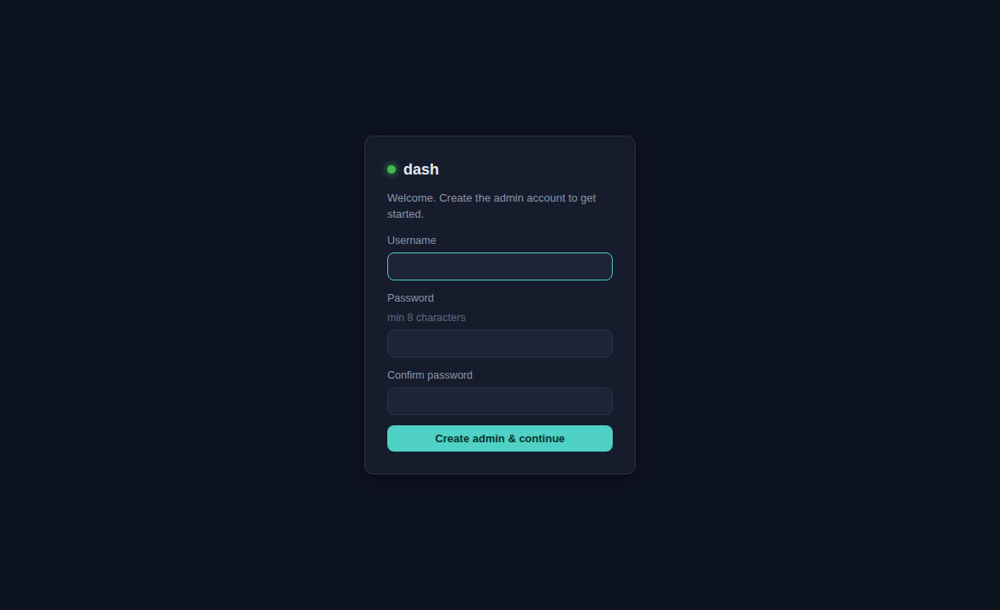
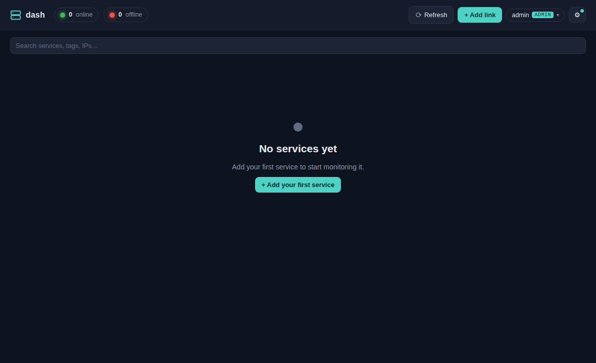
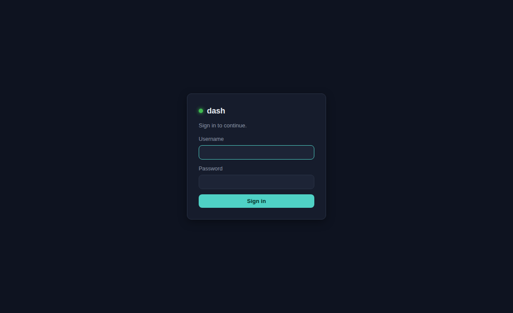

# Getting started

## Requirements

- **Docker Engine** + the **Docker Compose plugin**. Nothing else — Python and all
  dependencies live inside the container.

## Run it

```bash
docker compose up -d
# open https://localhost:8443
```

dash serves **HTTPS** with a self-signed certificate, so your browser shows a
one-time "not trusted" warning — choose *Advanced → proceed*. (See
[Deployment → HTTPS](./deployment.md#https--certificate) to reduce the warning.)

Your data — links, users, and the generated certificate — lives in `./data` on the
host, so it survives container rebuilds.

## First run: create the admin

On the very first visit (no users yet) dash shows a one-time setup screen. Choose an
admin username and password (minimum 8 characters, entered twice).



After that the dashboard starts empty, with a prompt to add your first service.



## Signing in

Once the admin exists, every visit requires a login. Any additional users you create
sign in the same way.



## Next steps

- [Add and monitor services](./user-guide.md)
- [Create more users](./administration.md)
- [Deploy to a server](./deployment.md)
