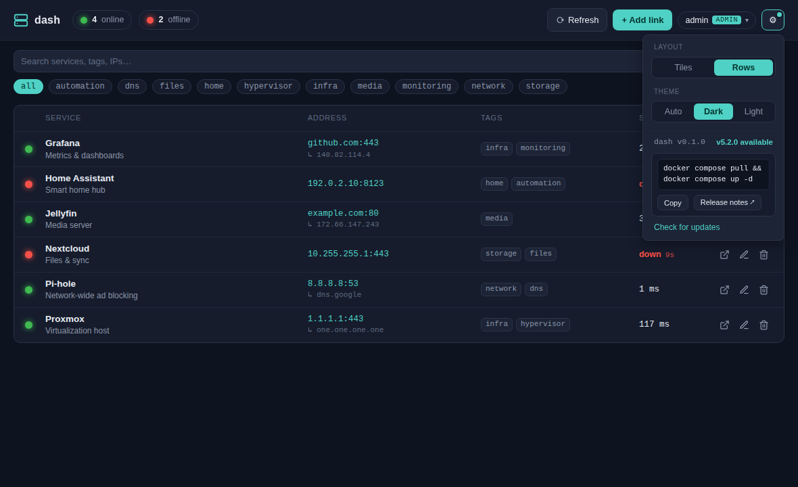

# Updates

dash can tell you when a newer release is available and hand you the exact command
to apply it. Detection is built in; applying is a deliberate one-liner you run —
dash never touches the Docker host itself (no Docker socket required).

## How it looks

The running version shows in the gear menu. When a newer release exists, the gear
gets a dot and the menu shows **"vX.Y.Z available"** with a copy-paste command and a
link to the release notes.



## How it works

- The running version comes from the `VERSION` file baked into the image
  (`/api/me` reports it).
- Set `DASH_UPDATE_REPO=owner/repo` to enable checks. dash queries that repo's
  latest GitHub release once a day (and on demand via **Check for updates**),
  caching the result.
- The check is **best-effort and fail-silent** — if the box is offline or the repo
  is unreachable, dash just keeps showing the running version.
- See [Configuration → Updates](./configuration.md#updates) for `DASH_UPDATE_COMMAND`
  and the other knobs.

## Publishing a release (GHCR)

The repo ships a GitHub Action (`.github/workflows/docker-publish.yml`) that builds
and pushes the image to GitHub Container Registry when a version tag is pushed:

```bash
# 1. bump the version
echo 0.2.0 > VERSION && git commit -am "release 0.2.0"
# 2. tag + push — the Action builds & pushes ghcr.io/<owner>/dash:{0.2.0,latest}
git tag v0.2.0 && git push --tags
# 3. publish a GitHub Release for v0.2.0 (this is what the update check reads)
```

Servers running an older version then show the update notice and update with
`docker compose pull && docker compose up -d`. The Action stamps `VERSION` from the
tag, so the image's reported version always matches the release.
