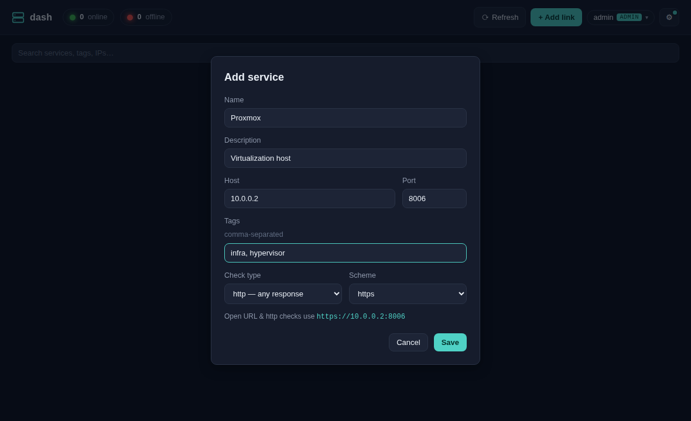
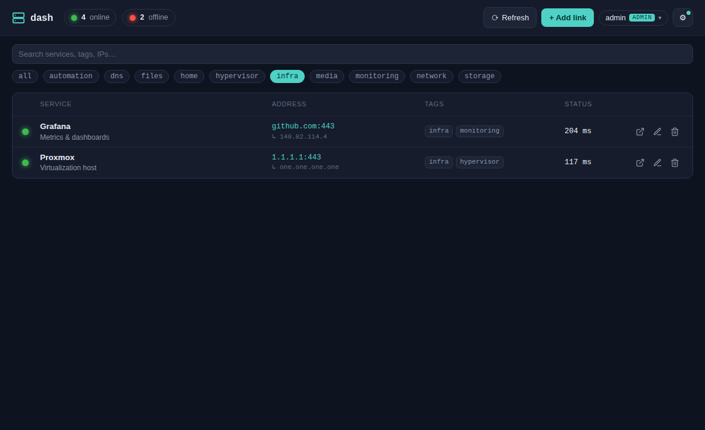
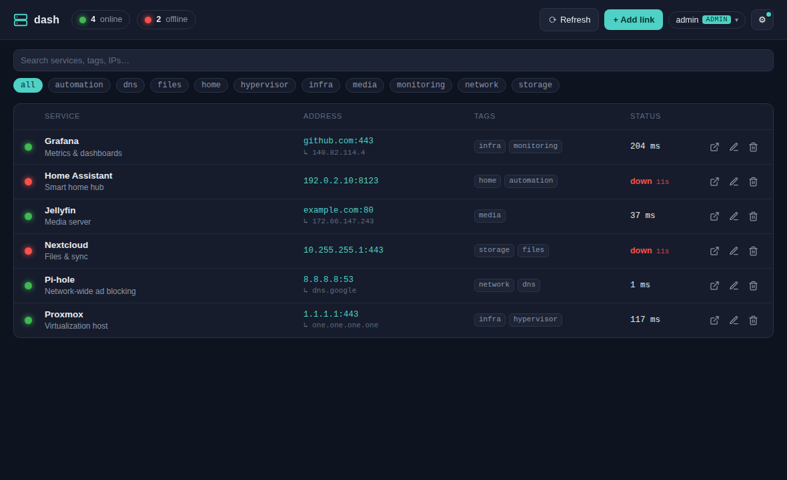

# User guide

## Adding a service

Click **+ Add link** and fill in the form:

| Field | Notes |
|-------|-------|
| **Name** | Display name (required) |
| **Description** | Short note shown under the name |
| **Host** | IP address or hostname (required) |
| **Port** | 1–65535 (required) |
| **Tags** | Comma-separated; become filter chips |
| **Check type** | `tcp` (is the port open?) or `http` (any response = up) |
| **Scheme** | `http` / `https` — used for the open link and for http checks |

The preview line shows the URL the card/row opens and that http checks use:
`scheme://host:port`.

## Status checks

dash checks every service **server-side** on a background loop (default every 30s),
so it works for internal hosts a browser couldn't reach directly.

- **tcp** — opens a TCP connection to `host:port`. Connects → **online**.
- **http** — sends `GET scheme://host:port` (TLS verification off, short timeout).
  **Any** HTTP response — including 401/403/404 — counts as **online**; only a
  connection error or timeout is **offline**.

Each service shows a status light, latency, and a "last checked" time. The light
**pulses amber** while a check is in flight. Click the light to re-check that one
service, or **Refresh** (top bar) to re-check everything.

Statuses: **online** (green), **offline** (red, with how long ago), **checking**
(amber, pulsing), **unknown** (not yet checked).

## DNS discovery

During each check dash resolves the host's counterpart and shows it under the
address with a `↳`:

- enter an **IP** → it shows the **name** (reverse / PTR lookup)
- enter a **hostname** → it shows the **IP** (forward lookup)

This depends on your network's DNS. The resolved value is also searchable.

## Search & filter

The search box matches name, description, host, tags, and the resolved DNS value.
Tag chips filter by tag — click one to narrow the list, **all** to clear.

## Views & theme

Open the **gear** menu (⚙, top right) to switch:

- **Layout** — Tiles (card grid) or Rows (dense table)
- **Theme** — Auto (follows your OS), Dark, or Light

Both are remembered in your browser.

**Tiles view:**

**Light theme:**

## Opening, editing, deleting

- Click a card/row (anywhere but the icons) to **open** the service in a new tab.
- Use the row icons (or hover a card) to **open ↗ / edit ✎ / delete 🗑**.
- Change your own password from the [account menu](./administration.md#the-account-menu).
